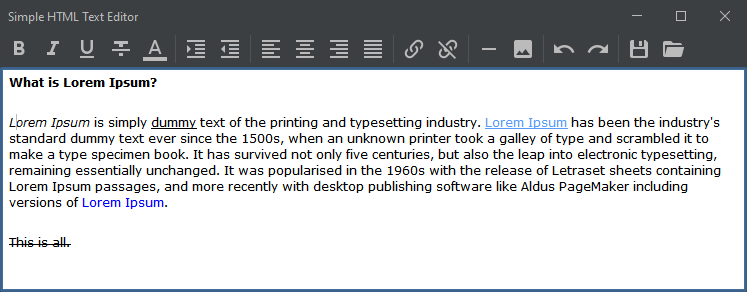
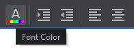

# Swing HTML Editor

Simple HTML Editor in Swing based on jHTMLEditor (https://github.com/ggrandes/jhtmleditor) because
the project was put in archived state.

## License

Open Source Java project under Apache License v2.0 (the same as jHTMLEditor)

---

## Requirements, Installation and Running

* Java Runtime (8 or newer)

---

## Screenshots

###### Main Window 

###### Most of the controls have "hints" 

---

## Credits

Notable contributions:

* [@ggrandes] for the original source code
* [@DevCharly](https://github.com/DevCharly) for [FlatLaf](https://github.com/JFormDesigner/FlatLaf).
* [@aalmiray](https://github.com/aalmiray) for [Ikonli](https://github.com/kordamp/ikonli).
* ... many others - thank you for contributing to FLOSS.

---
Inspired in [Howard Kistler's Ekit](http://www.hexidec.com/ekit.php) and [Charles Bell's HTMLDocumentEditor](https://gist.github.com/ggrandes/4079765ac52942cf6b93014dd3278bdd),  this code is Java-minimalistic version.
